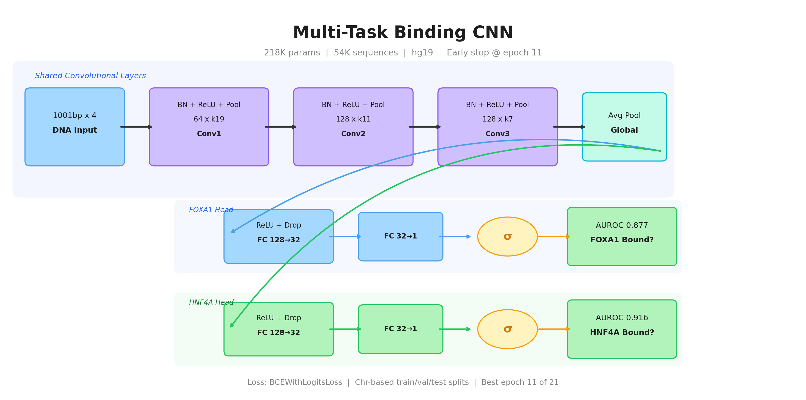

# FOXA1-HNF4A Binding CNN

Multi-task convolutional neural network for predicting FOXA1 and HNF4A transcription factor binding from DNA sequence, with interpretability analysis (DeepLIFT, TF-MoDISco) and in silico cooperativity experiments.

## Overview

This repo contains two deep learning pipelines built on CUT&Tag data from [Hansen et al. (eLife 2022)](https://doi.org/10.7554/eLife.76539), which profiles FOXA1 and HNF4A binding in K562 cells with a dox-inducible expression system (GSE182189).

### Pipeline 1: Multi-task binding CNN (`binding_*`)
- **Task**: Binary prediction of FOXA1 binding and HNF4A binding from 1001 bp DNA sequences
- **Architecture**: 3 convolutional layers (shared) → global average pooling → 2 independent sigmoid heads
- **Parameters**: ~218K
- **Performance**: AUROC >0.90 for both TFs

### Pipeline 2: 4-class site classifier (`dl_*`)
- **Task**: Classify genomic sites as FOXA1-Pioneered (FP), HNF4A-Pioneered (HP), Co-Bound (CB), or Both-Pioneer
- **Architecture**: Dilated CNN with residual connections (~250K params)

## Repository structure

```
foxa1-hnf4a-binding-cnn/
├── src/                          # All source code
│   ├── binding_model.py          # BindingCNN architecture (multi-task)
│   ├── binding_data.py           # Data prep, chr-based splits, DataLoaders
│   ├── binding_train.py          # Training loop, evaluation, ROC/PR curves
│   ├── binding_deeplift_modisco.py  # DeepLIFT attributions + TF-MoDISco
│   ├── binding_cooperativity.py  # In silico spacing/orientation cooperativity
│   ├── binding_category_cooperativity.py  # Category-aware motif scrambling
│   ├── dl_model.py               # 4-class architectures (dilated + simple)
│   ├── dl_data.py                # 4-class data loading from FASTA
│   ├── dl_train.py               # 4-class training with class weights
│   ├── dl_interpret.py           # DeepLIFT + MoDISco for 4-class model
│   ├── dl_mutagenesis.py         # In silico mutagenesis experiments
│   └── dl_run_all.py             # Master script for 4-class pipeline
├── data/
│   ├── genome/                   # hg19.fa (not tracked)
│   └── raw/                      # narrowPeak files (not tracked)
├── results/
│   ├── peaks/                    # Consensus peaks
│   ├── classified/               # FP/HP/CB classified BED files
│   ├── sequences/                # Extracted FASTA sequences
│   ├── fimo/                     # FIMO motif scan results
│   └── deep_learning/            # Model checkpoints, attributions, outputs
├── figures/                      # Generated plots (not tracked)
├── requirements.txt
└── .gitignore
```

## Setup

```bash
pip install -r requirements.txt
```

## Data preparation

The CNN expects pre-processed data from the upstream motif grammar pipeline. You need:

1. **Consensus narrowPeak files** in `results/peaks/`:
   - `FOXA1_alone_FOXA1ab.consensus.narrowPeak`
   - `HNF4A_alone_HNF4Aab.consensus.narrowPeak`
   - `FOXA1_HNF4A_FOXA1ab.consensus.narrowPeak`
   - `FOXA1_HNF4A_HNF4Aab.consensus.narrowPeak`

2. **Classified site BEDs** in `results/classified/`:
   - Sites classified as FP, HP, CB, or both_pioneer

3. **Extracted FASTA sequences** in `results/sequences/`:
   - `FP.fa`, `HP.fa`, `CB.fa`, `both_pioneer.fa` (summit +/- 500 bp from hg19)

4. **Genome FASTA** in `data/genome/`:
   - `hg19.fa` with samtools index

5. **FIMO results** in `results/fimo/` (for category cooperativity):
   - `CB_parsed.tsv`, `FP_parsed.tsv`, `HP_parsed.tsv`

## Usage

### Train the multi-task binding CNN

```bash
python src/binding_train.py
```

Trains with chromosome-based splits (train: chr1-15, val: chr16-19, test: chr20-22+X+Y), early stopping, and BCEWithLogitsLoss with positive class weights. Saves model to `results/deep_learning/binding/binding_model.pt`.

### Run DeepLIFT + TF-MoDISco

```bash
python src/binding_deeplift_modisco.py
```

Computes per-head DeepLIFT attributions (FOXA1 head and HNF4A head separately) using an all-zeros reference, then runs TF-MoDISco to discover motif patterns from each head's importance scores.

### In silico cooperativity

```bash
python src/binding_cooperativity.py
python src/binding_category_cooperativity.py
```

Tests whether the model learned cooperative binding by:
- Implanting FOXA1/HNF4A motif pairs at varying spacings into random backgrounds
- Scrambling real motifs at FIMO-identified positions and measuring cross-TF prediction changes

### Run the 4-class pipeline

```bash
python src/dl_run_all.py                 # Full pipeline
python src/dl_run_all.py --train-only    # Training only
python src/dl_run_all.py --skip-modisco  # Skip MoDISco (faster)
```

## Model architecture (binding CNN)



## Citation

Data from:

> Hansen JL, Loell KJ, Cohen BA. A test of the pioneer factor hypothesis using ectopic liver gene activation. *eLife*. 2022;11:e73358. doi:10.7554/eLife.73358
